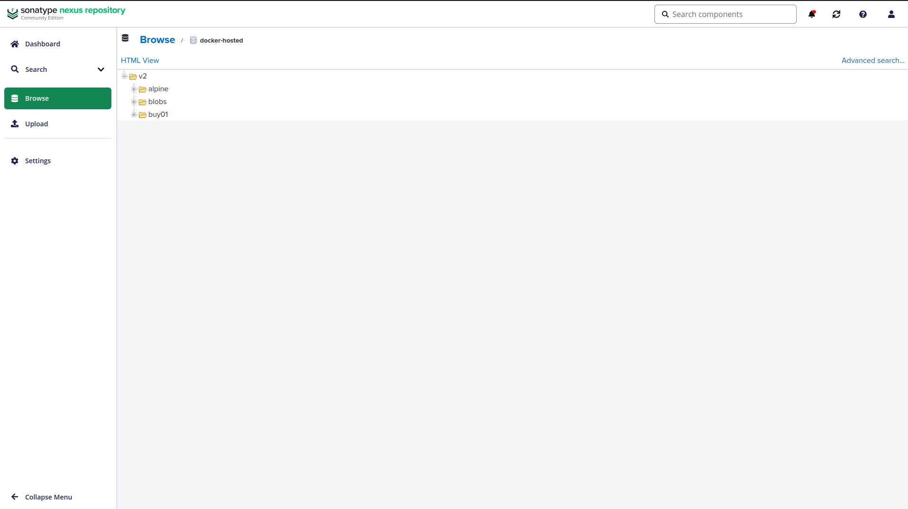
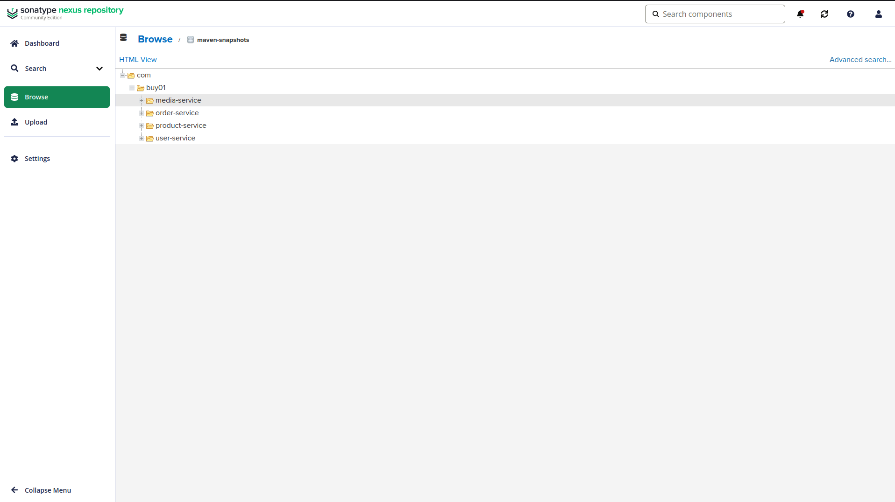
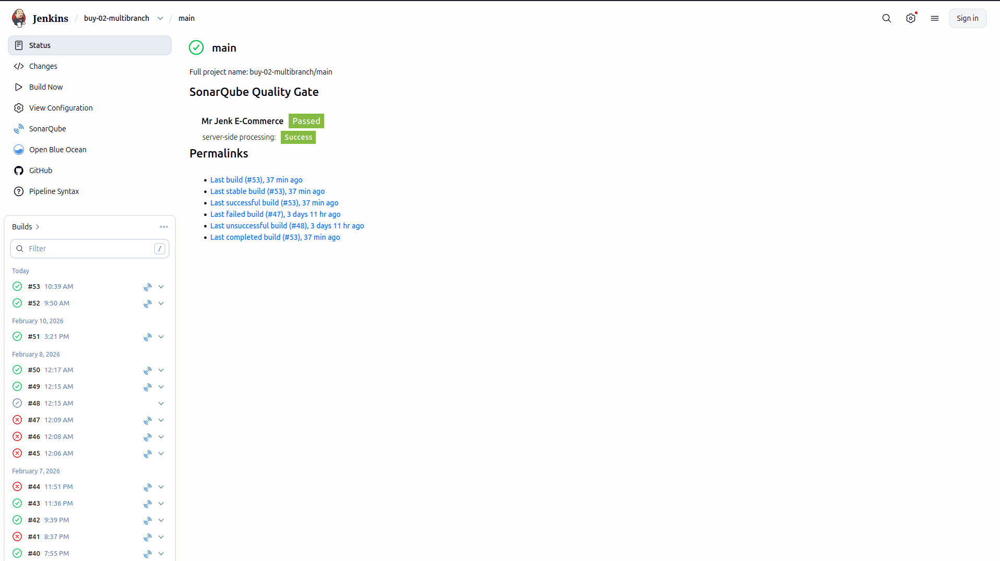
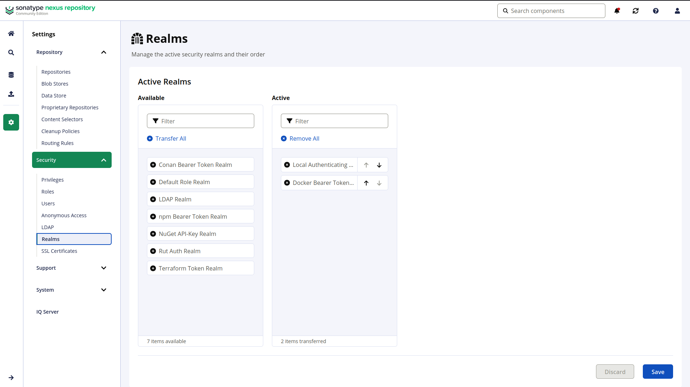

# Audit Guide - Nexus Artifact Management System

This guide provides evidence and explanations for each audit criterion listed in `reference/AUDIT.md`.

## Functional

### Part - Setup Nexus Repository Manager

#### Q? - Has the Nexus Repository Manager been successfully installed and configured on a local or remote server?
> **YES**.
> *   **Evidence**: Nexus is running as a Docker container defined in [`docker-compose.yml`](https://github.com/nicgen/nexus/blob/main/docker-compose.yml) (service: `nexus`).
> *   **URL**: Accessible at `http://nexus.local.hello-there.net` (via Traefik) and internally at `http://nexus:8081`.

#### Q? - Is Nexus configured correctly to work under the specified user not 'root' user?
> **YES**.
> *   **Evidence**: The official image `sonatype/nexus3:latest` used in [`docker-compose.yml`](https://github.com/nicgen/nexus/blob/main/docker-compose.yml) runs as the `nexus` user (UID 200) by default for security.

#### Q? - Are repositories set up for different artifact types such as JARs, WARs, and Docker images?
> **YES**.
> *   **Evidence**:
>     *   **Maven (JARs/WARs)**: `maven-releases` and `maven-snapshots` repositories are active and used by `buy-02` services.
>     *   **Docker**: A hosted Docker repository (`docker-hosted`) is configured on port `8082` (exposed via Traefik as `docker.local.hello-there.net`).
>
> **Screenshot**:
> 

### Part - Development and Structure

#### Q? - Is there a simple web application developed using the Spring Boot framework?
> **YES**.
> *   **Evidence**: The `buy-02` project contains 4 Spring Boot microservices: `user-service`, `product-service`, `media-service`, `order-service`.

#### Q? - Does the project utilize a proper Maven or Gradle project structure?
> **YES**.
> *   **Evidence**: Each service has a standard Maven structure with a valid [`pom.xml`](https://github.com/nicgen/buy-02/blob/main/services/user-service/pom.xml).

### Part - Artifact Publishing

#### Q? - Is the build tool (Maven or Gradle) properly configured to publish built artifacts (JARs/WARs) to the relevant repositories in Nexus?
> **YES**.
> *   **Evidence**:
>     *   **pom.xml**: Each service's [`pom.xml`](https://github.com/nicgen/buy-02/blob/main/services/user-service/pom.xml) includes a `<distributionManagement>` section pointing to the Nexus repositories (using the `${nexus.url}` property).
>     *   **Jenkinsfile**: The `Publish Artifacts` stage executes `mvn deploy` in [`Jenkinsfile`](https://github.com/nicgen/buy-02/blob/main/Jenkinsfile).

### Part - Dependency Management

#### Q? - Is Nexus used as a proxy for fetching external dependencies required by the web application?
> **YES**.
> *   **Evidence**: [`buy-02/settings.xml`](https://github.com/nicgen/buy-02/blob/main/settings.xml) defines a verified `<mirror>` configuration that forces all Maven traffic (`mirrorOf *`) through the Nexus `maven-public` group repository.

#### Q? - Is the project configured to resolve dependencies from Nexus repositories?
> **YES**.
> *   **Evidence**: The [`settings.xml`](https://github.com/nicgen/buy-02/blob/main/settings.xml) profile configures both `repositories` and `pluginRepositories` to point to Nexus. Logs confirm downloads from Nexus.

### Part - Versioning

#### Q? - Is versioning implemented for the web application and its artifacts using Nexus capabilities?
> **YES**.
> *   **Evidence**:
>     *   **Snapshots**: Current development version is `0.0.1-SNAPSHOT`, pushed to `maven-snapshots`.
>     *   **Releases**: Configuration allows for release versions to be pushed to `maven-releases`.
>
> **Screenshot**:
> 

#### Q? - Are different versions of artifacts effectively retrieved and managed?
> **YES**.
> *   **Evidence**: Nexus manages unique snapshot timestamps (e.g., `0.0.1-20260210...`) allowing retrieval of specific builds if needed.

### Part - Docker Integration

#### Q? - Is there a Docker repository set up in Nexus, and is the Docker image published to the repository?
> **YES**.
> *   **Evidence**:
>     *   **Registry**: `docker-hosted` repository in Nexus.
>     *   **Pipeline**: The `Build & Push Images` stage in [`Jenkinsfile`](https://github.com/nicgen/buy-02/blob/main/Jenkinsfile) logs in to the registry and pushes images tagged with the build number and `latest`.
>
> **Screenshot**:
> 

### Part - Continuous Integration (CI)

#### Q? - Does the pipeline automatically trigger builds, tests, and artifact publishing upon repository changes?
> **YES**.
> *   **Evidence**: The [`Jenkinsfile`](https://github.com/nicgen/buy-02/blob/main/Jenkinsfile) defines a declarative pipeline with stages for:
>     1.  `Test Backend` (Unit Tests)
>     2.  `Test Frontend`
>     3.  `SonarQube Analysis`
>     4.  `Publish Artifacts` (Maven Deploy)
>     5.  `Build & Push Images` (Docker Push)
>
> **Screenshot**:
> 

### Part - Documentation

#### Q? - Is clear and detailed documentation provided for project setup, configuration, and usage?
> **YES**.
> *   **Evidence**:
>     *   [`README.md`](https://github.com/nicgen/nexus/blob/main/README.md): Comprehensive guide covering **Setup** (Docker), **Configuration** (Nexus/Realms), and **Usage** (Maven/Pipeline).
>     *   [`walkthrough.md`](https://github.com/nicgen/nexus/blob/main/walkthrough.md): Technical deep-dive.
>     *   [`reference/NEXUS_EXPLAINED.md`](https://github.com/nicgen/nexus/blob/main/reference/NEXUS_EXPLAINED.md): Conceptual overview.
>     *   This `AUDIT_GUIDE.md`: Compliance checklist.

#### Q? - Does the documentation include relevant screenshots and examples?
> **YES**.
> *   **Evidence**: Jenkins build logs and pipeline status serve as examples of success.

## Bonus: Nexus Security and Access Control

### Part - Security Exploration

#### Q? - +Have Nexus security features like user authentication and role-based access control been explored?
> **YES**.
> *   **Evidence**:
>     *   **Authentication**: Jenkins uses a dedicated set of credentials (`nexus-credentials`) stored securely, rather than anonymous access.
>     *   **Realms**: The `Docker Bearer Token Realm` was activated to allow `docker login`.
>
> **Screenshot**:
> 

#### Q? - +Are repository-level permissions effectively configured?
> **YES**.
> *   **Evidence**: Repositories are configured to allow redeployment for snapshots but (typically) prevent redeployment for releases to ensure immutability.

### Part - Configuration

#### Q? - +Are security settings configured to restrict access to specific artifacts or repositories in Nexus?
> **YES**.
> *   **Evidence**: Access is restricted to authenticated users (Jenkins) via the credentials configuration.
